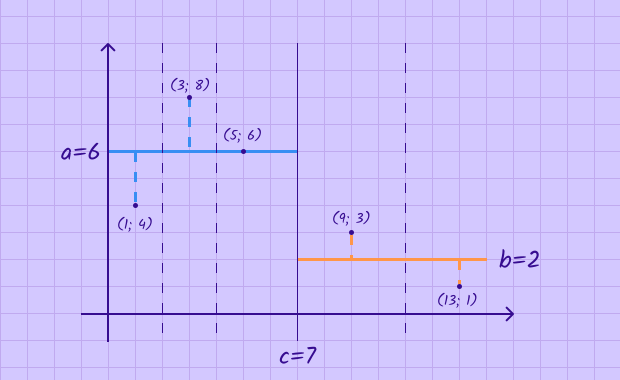
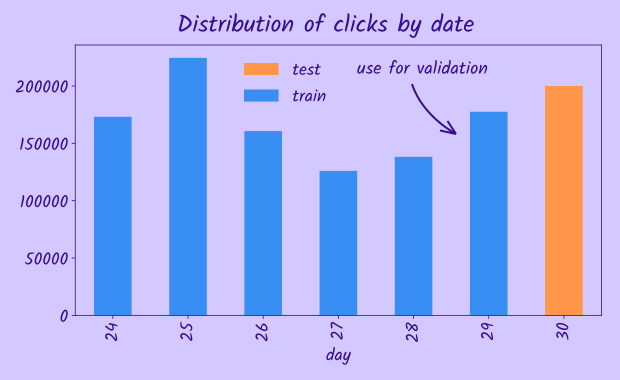
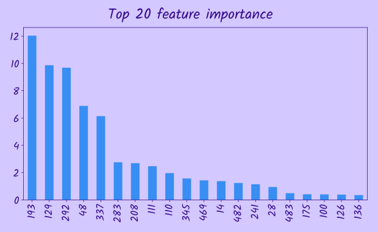
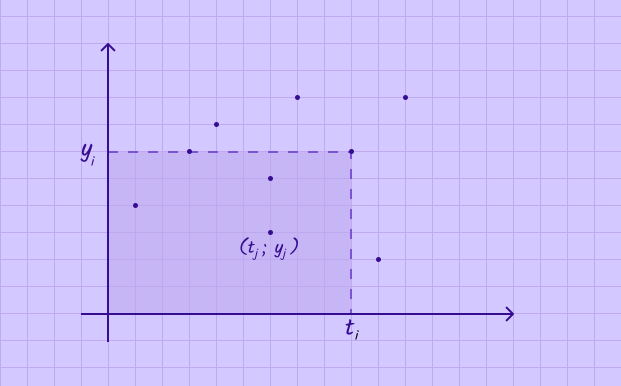
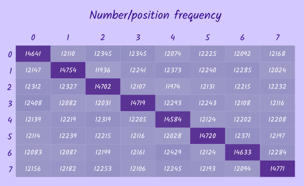
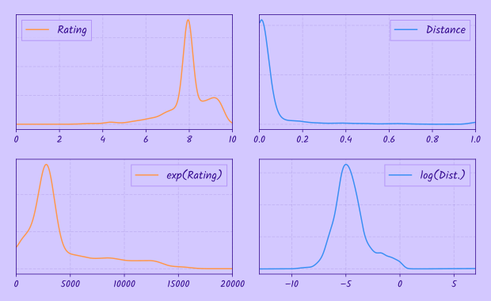
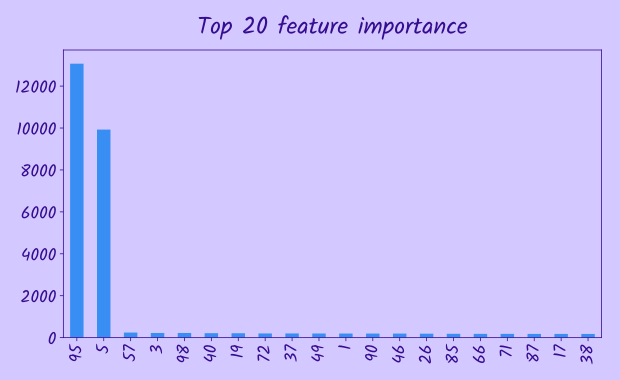
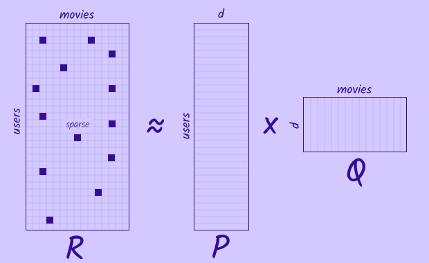
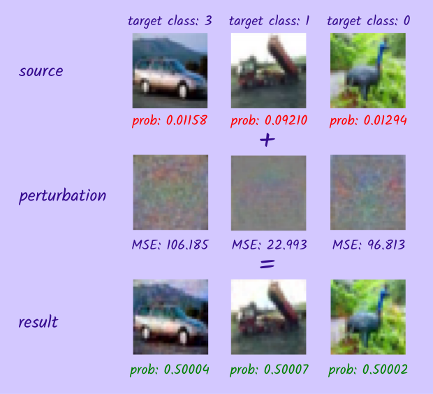
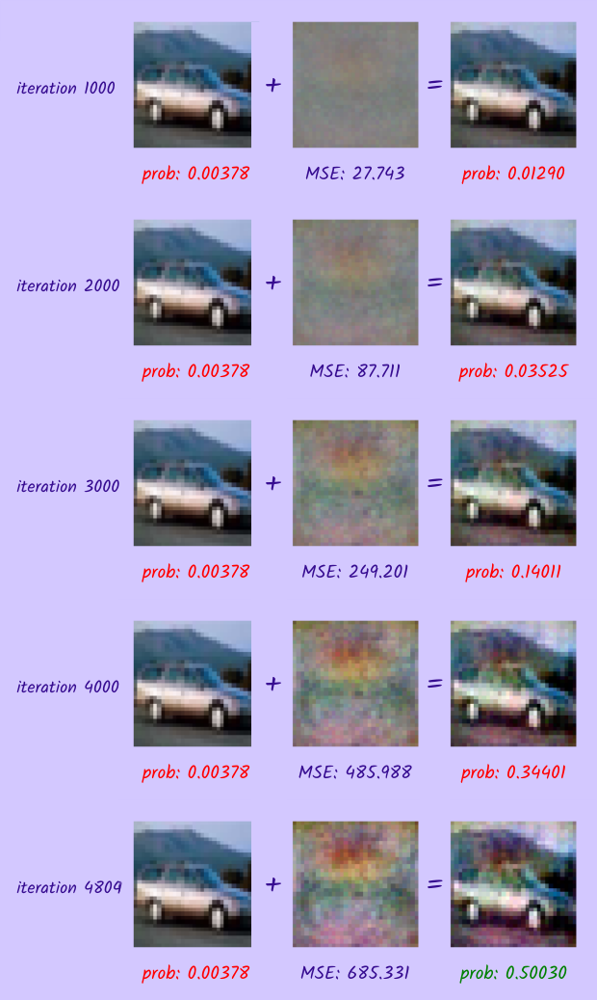

This repo contains solutions of all 17 tasks from all qualification and final rounds of [Yandex.Blitz Machine Learning competition](https://contest.yandex.ru/contest/8470) held in the end of June, 2018.

I didn't participate in the competition when it was really held so this is not real leaderboard (unfortunately). On the other hand I had more time to explore problems, learn something new and try different approaches.

Quickly jump to:

- [A. Stump](#a-stump)
- [B. Coefficients restoration](#b-coefficients-restoration)
- [C. Freshness detector](#c-freshness-detector)
- [D. Feature selection](#d-feature-selection)
- [E. Warm up](#e-warm-up)
- [F. Generalized AUC](#f-generalized-auc)
- [G. Permutations](#g-permutations)
- [H. Restaurants](#h-restaurants)
- [I. Warm up](#i-warm-up)
- [J. Linear separability problem](#j-linear-separability-problem)
- [K. Unique queries](#k-unique-queries)
- [L. Wi-Fi](#l-wi-fi)
- [M. Pairwise ranking](#m-pairwise-ranking)
- [N. Coins](#n-coins)
- [O. SVD recommender](#o-svd-recommender)
- [P. Adversarial attack (white-box)](#p-adversarial-attack-white-box)
- [Q. Adversarial attack (black-box)](#q-adversarial-attack-black-box)

# A. Stump

The are 3 important observations here:

1. All possible candidates for split (i.e. **c** value) are all points in the middle of 2 consecutive  coordinates (dashed lines in the image). So we have to check only  variants (or less if some points have equal  coordinates).
2. If we fix **c** then optimal values for **a** and **b** that minimize MSE would be just mean of  coordinates of all points on each side of the split.
3. If we will naively calculate mean for each split by iterating over all points we'll get  complexity which will not work, so instead we should sort all points by  and then store sums of  and  for left and right sides of current split. Then going to next  we can update those sums only by value of points that change side. Thus we will be able to easily compute mean as well as MSE for both sides and find split that minimizes MSE in , though overall complexity will be  due to sorting.

Implementation: [a.py](a.py)

# B. Coefficients restoration

Let's ignore noise and define the following function (MSE):

To find coefficients *a*, *b* and *c* we minimize this function using `scipy.optimize.minimize`.

Implementation: [b.py](b.py)

# C. Freshness detector

That is pretty straightforward classification problem. Though there are 2 question to address:

1. **How to use query text**. Though we are provided with obfuscated query text, nevertheless we still can use standard `TfidfVectorizer` from sklearn to calculate tfidf features - just need to customize `token_pattern` a little bit.
2. **How to perform validation**. If we look at dates in train and test sets we'll notice that all dates in test data go the next day after training dates. Namely, training dates are 24-29 of January and test date is 30 of January. So in order to validate we can split training data into training - 24-28 of January and validation - 29 of January.

After we decided on these questions we can feed the data into a classifier. I used **lightgbm** for this purposes because it works well with sparse features and is very fast.

The last thing to note is that usage of query features is important for this task because without them we can only get , which is not enough, but when we add query information we can get .

Implementation: [c.ipynb](c.ipynb)

# D. Feature selection

In order to extract most important features, we train catboost model with specified parameters `CatBoostRegressor(n_estimators=200, learning_rate=0.1)` and then use `get_feature_importance` method to extract top 50 most imporant features.

In the task statement it is said that cross-validation is being performed in inverse manner: we train on small amount of data (1000 samples) and validate on much larger data (9000 samples), so it is easy to overfit in this setting. The more features we have, the easier it is to overfit. Although we are constrained to select no more than 50 most important features, but we also could try to select less, and submit 40, 30, 20 top features. Indeed sending only 20 features gives us best result and we get 4 points (max for the task) on the leaderboard.

Implementation: [d.ipynb](d.ipynb)

# E. Warm up

Just feed the data into sklearn `LinearRegression` model.

Implementation: [e.ipynb](e.ipynb)

# F. Generalized AUC

This problem looks less like machine learning problem but more like traditional competive programming problem.

Let's recall the formula for generalized AUC:

The naive solution would be to go over all pairs of  and  and just calculate cases when  and , though the complexity will be  and we'll get TL for . So we need something smarter.

Let's try to put those points on a plane:  on -axis, and  on -axis. Thus going from left to right on X-axis for fixed  all points to the left will have  and we just need to calculate number of points that also have  among them. Geometrically this means that we should calculate number of points in rectangle , of course we should not forget to consider cases when  - points that lie on the top border of the rectangle. Naively calculating points inside this rectangle still requires , so we should somehow organize our points to be able to quickly answer the question "how many points are there which have  and ". To do so, we will store all  of points that lie to the left of  in a sorted array or a binary tree. Initially this array will be empty, but as we go from the left to the right along the -axis we'll add points there. Notice, that we don't care about specific -coordinates of points in this array. All we need to know is that their -coordinate is less than current . So, if we have such sorted array/bin tree, then we can easily answer to the required question in  time doing binary search. The only question to cover yet is how much time do we need to insert new points into our array/bin tree. In case of sorted array if we insert some elements in the middle of it we might need to shift all other elements to the right of it, so we might need  in worst case. In case of binary tree, if the tree is balanced insertion will take  time, though if it is not we'll end up with  still. Let's hope we will be lucky and the order of elements will be random, so the tree will be quite balanced.

I ended up with several implementations for this task using C++ and Python and trying sorted array/binary tree. Though sorted array required  time it surprisingly didn't get TL even using Python implementation. But it was very-very close to it. Binary tree version of solution was much faster using C++ implementation and took only *125ms* for the longest test case. But Python version of it was quite slow, even slower than sorted array version, so it exceeded the TL.

Implementation: [f_naive.cpp](f_naive.cpp), [f_sorted_naive.cpp](f_sorted_naive.cpp), [f_fastest.cpp](f_fastest.cpp), [f_sorted_naive.py](f_sorted_naive.py)

# G. Permutations

As it is said in the task description, stupid permutation function has a bug. As a result not all permutaitions occur evenly - some may occur more often while others less often. Let's generate 100000 stupid permutations and calculate how often each of numbers (0-7) was placed on each position (0-7).

Columns in matrix represent numbers, while rows - positions. Thus the number in each cell means how many times each number was on each position.

From the matrix we see, that the bug in stupid permutation causes some numbers to stay on initial position more often, than it should be if all permutations were evenly distributed. E.g. 0 stays on position 0, 1 on 1, 2 on 2 etc.

So all we are left to do is calculate number of such permutatations in groups of 1000 of them and sort by this number in ascending order, thus, random permutations will go first and stupid ones later.

Implementation: [g.ipynb](g.ipynb)

# H. Restaurants

We will use a simple linear model with 2 coefficients to predict restaurant score based on distance and rating:

We may notice that the expression we are asked to minimize is exactly the negative log likelihood (divided by constant *N*) or loss function of logistic regression:

Because logistic regression requires only labels 0 or 1 and target metric will be evaluated on pairs with known winner and looser, we will omit samples with ties (0.5 target) during training. To solve logistic regression we will use SGD.

After we obtain coefficients of scoring model we can use them to score all restaurants in the test data.

Another very important detail worth mentioning is rating and distance transformations before training. If we plot distance and ratings distributions we might notice that there are a lot of small distances near zero and ratings are concentrated around 7-8. Logically, users might be much more sensitive to difference between 100 meters and 1 km than 100km and 101 km. On the contrary low ratings 2 or 3 are percieved as almost equally poor, while difference between 8 and 9 rating feels more important. In order to take this into account, we might try to apply log transformation to distances and exponential transformation to ratings. Indeed, the model without any transformations scored 1.5 on the leaderboard, when using only distance transformation score raised up to 3.5, and after we applied both transformation we achieved max score of 4 points.

Implementation: [h_exploration.ipynb](h_exploration.ipynb), [h.py](h.py)

# I. Warm up

Although it is stated that we should find a linear function, I was unable to train linear model, so I used **lightgbm**, which might be an overkill for this task, but anyway. 

As it is said that only few features are relevant, we'd like to find out what are those features.

We see that features 5 and 95 are the most important ones. Let's look at them and the target:

|      | 5    | 95   | 100(target) |
| ---- | ---- | ---- | ----------- |
| 0    | 0    | 1    | 1           |
| 1    | 0    | 1    | 1           |
| 2    | 0    | 0    | 0           |
| 3    | 1    | 1    | 0           |
| 4    | 1    | 1    | 0           |
| 5    | 1    | 1    | 0           |
| 6    | 1    | 1    | 0           |
| 7    | 1    | 1    | 0           |
| 8    | 0    | 1    | 1           |
| 9    | 0    | 1    | 1           |

Looks like XOR: . Double-checking on the whole dataset confirms our hypothesis.

Implementation: [i.ipynb](i.ipynb)

# J. Linear separability problem

The task is given a set of points  and their respective classes  to find a hyperplane separating those points according to their classes. Formally, find such a vector  that:

Although there are a few linear models that might be applicable to this task, namely linear/logistic regression, SVM, perceptron, not all of them will find a hyperplane that splits all points exactly. This can happen if, according to the respective loss function, it is 'cheaper' to misclassify a single point, but the total loss for other points will be less. Though it doesn't apply to the perceptron model - it tries to find separating hyperplane, that splits the classes exactly, if it is possible, but if not it will never converge. In the task statement it is said that the input dataset is known to be linearly separable, so we can use the perceptron here. During training only points that are misclassified contribute to the error, so if a point was already classified correctly it doesn't matter how far it is from decision boundary, so we may end up with decision boundary being very close to some of training points, but in our task that is acceptable, as we don't have any other requrements for the hyperplane.

The perceptron model has  parameters  and maps the input vector  to the output class :

In order to find the parameters of vector , an iterative update rule is used:

Despite linear/logistic regression might not always find separating hyperplane correctly, my solutions using both of them were accepted - probably the tests were not so hard and the points were separated by a wide margin.

Implementation: [j.py](j.py)

# K. Unique queries

The idea for this task is to implement some kind of [Bloom filter](https://en.wikipedia.org/wiki/Bloom_filter). *Some kind* because actually we will use *k* = 1 (number of filters). So it will be more like regular hash-table but without storing the values of elements - only their hashes. There is a formula for calculating false positive rate of *Bloom Filter* depending on number of unique elements, size of filter and number of filters, but for me it was easier to write a small test to check the error rate for various combinations of parameters.

I used 2 a bit different implementations, though in both of them I used `bytearray` which I never used before - that is just, as its name says, array of bytes, just more memory efficient than usual `list` of any objects. Using it, it was possible to allocate array of 1,000,000 elements keeping memory usage below 5MB. That is more bytes that we could probably allocate if we were using C++, because its memory limit was 10x times lower - just 500KB. For calculating hashes of queries I used built-in function `hash` which is actually used for hashing elements in regular python hash-tables aka dicts.

So, being able to use hash-table of size 1,000,000 it was possible to implement a very straightforward solution, using whole bytes to store just 1 bit of information - whether we've seen such hash before or not. Though, probably the error rate was pretty close to 5%. Another a bit more sophisticated but more robust approach was to use every bit of a single byte, thus we can achieve even lower error rates using just 200,000 bytes.

Implementation: [k_test.ipynb](k_test.ipynb), [k_bytearray.py](k_bytearray.py), [k_bitarray.py](k_bitarray.py)

# L. Wi-Fi

The most important observation in this task is similarity between **ssid** and **organization name** for those rows where *target=1*. Here are just a few samples with *target=1*:

| id   | names                                             | ssid                |
| ---- | ------------------------------------------------- | ------------------- |
| 18   | ["Аэропорт Толмачево, бухгалтерия", "Толмачево"]  | Tolmachevo-MTS-Free |
| 38   | ["Kontrolmatik"]                                  | Kontrolmatik_Staff  |
| 49   | ["ПКВ Моторс", "Pkw Motors", "Pkw Motors", "Те... | PKW Guests          |
| 77   | ["Техцентр Юста", "Tekhtsentr Yusta", "Юста", ... | YUSTA               |
| 94   | ["Респект Авто", "Автосервис"]                    | RespectAuto         |

While **ssid** contains mostly latin characters, organization names might be in other languages like russian, so we need to perform some transliteration before calculating similarity. After that we will compute similarity between 2 strings as number of n-grams ocurred in both strings. We will use **n=1..8**. Also we'll compute similarity for **ssid** and **urls** fields, because **urls** might also include some substrings from **ssid**.

Other features are more obvious: we calculate distance between user and organization and perform one-hot encoding of **rubrics**. Also we feed some fields as is, like **has_wifi**, **publishing_status**.

For validation I used 20% of data. Though it was important to perform group-aware splits, that's why I used `GroupShuffleSplit` which places all samples from one group to either train or test set, so that test and train sets have non-intersecting groups.

For training I used **lightgbm** model, which after *170* iterations scored *3.71* on the leaderboard that corresponds to 95% accuracy.

Implementation: [l.ipynb](l.ipynb)

# M. Pairwise ranking

This task might look similar to [H. Restaurants](#h-restaurants). The training dataset here is also composed of pairs of items and we are asked to maximize log likelihood of the data. Though, unlike task H, here we don't have any features of objects that can be used as input to scoring model, so instead we will consider each -th object's score as a parameter/weight . 

Thus our task can rewritten as:

Or in vectorized form:

Where  - vector of all objects' scores and  - is  design matrix, where each row contains only 2 non-zero elements, namely  and  for all .

There is always  on the right side of equation because first object  is always preferred over the second .

After those preparations we can just fit logistic regression to obtain scores .

Implementation: [m.py](m.py)

# N. Coins

Well, the first straightforward idea was simply to calculate frequency of getting heads up  and sort coins by this number. But, unfortunately, it didn't work. The problem is that if we have 2 coins  and  with  and  then we will get . Which means that we will consider both of the coins to have equally low chance of getting heads up . Though, intuitively, of course, it doesn't seem right: if we toss a coin only single time and didn't get heads up, we shouldn't be so confident that we will never get it at all, though if we didn't get a single heads up after 50 tosses, well, chances to get a one are really low. At this point we should probably start to realize that Bayesian statistics was invented for a reason. 

Unfortunately my understanding of Bayessian statistics not as profound as I'd like, but the idea is that instead of estimating a single number  we deal with whole distibution of all possible values of . In order to do this, we choose some plausible prior distribution, which in case if we don't have any specific information, we may choose as  - standard uniform distibution, i.e. all  are equally likely. Then after each toss we update the resulting distribution (a posteori) according to the observed outcome, thus the initial distibution is gradually shifting towards the true distribution. In the end to be able to compare a posteori distribution of different coins, we still have to come up to a single number (point estimate), but this time we  have some options how to calculate it from whole distibution. The most common approaches are to select mode (maximum a posteori) or mean (expected value) of the distibution. Intuitively expected value contains more information about the distribution because it is integral over all possible values, while maximum value is just a single point. So we'll use mean of the distribution as its point estimate.

That was an overall justification, now let's get to our task. According to wikipedia articles [Checking whether a coin is fair](https://en.wikipedia.org/wiki/Checking_whether_a_coin_is_fair) and [Beta distribution](https://en.wikipedia.org/wiki/Beta_distribution) we know that the a posterior distribution of  after getting  heads and  tails is in fact a  distribution:  with probability density function:

From the properties of  distribution we know that its expected value is , while its mode is . So if we would use mode instead of mean we would get the same results as our initial idea that didn't work.

Implementation: [n.py](n.py)

# O. SVD recommender

This task is classical recommender system. It is well known since Netflix competition in 2006-2009. One
of the competitors Simon Funk has [really nice description](http://sifter.org/simon/journal/20061211.html) of his method that uses SGD to find matrix factorization. It is good, because we don't need to deal with huge sparse matrices.

Another useful resource was [suprise](http://surpriselib.com/) library. It does exactly what is required in our task and 
it has convenient methods to get sample data for testing purposes. We will try to implement our own algorithm
to find matrix factorization and compare the results with those received using this library.

The algorithm is pretty straightforward. The [idea](http://surprise.readthedocs.io/en/stable/matrix_factorization.html#surprise.prediction_algorithms.matrix_factorization.SVD) is to represent ratings as 

Where:

 - per user average rating minus global average, vector of size  
 - per movie average rating minus global average, vector of size  
 - user embedding, vector of size  (number of factors) 
 - movie embedding, vector of size  (number of factors) 

We initialize these variables with some random values and then iterate over each known user-movie-raiting tuples and compute 
error. Then we update just a little bit all parameters to minimize the error:

Where ,  - regularization parameter,  - learning rate.

Implementation: [o_test.ipynb](o_test.ipynb), [o.py](o.py)

# P. Adversarial attack (white-box)

The idea is to start with the source image and incrementally update it a little bit in opposite gradient (w.r.t. input image) direction, so that with each iteration the model predicts higher and higher probability that the image belongs to the target class. As long as we know the underlying model is plain linear classifier with softmax activation, we can analytically compute the gradient of the loss function w.r.t. the input.

The loss function that we are going to minimize is:

Where  - is original the image,  - target class,  - -th output of softmax,  - is regularization parameter. Then partial derivatives will be:

The whole gradient in vector form can be written as:

Where  - column vector of outputs of softmax,  - unit column vector  where all elements are zeros except -th which is .

Then incremental update rule will be:

Implementation: [p.ipynb](p.ipynb)

# Q. Adversarial attack (black-box)

This task is similar to the previous white box adversarial attack, but here we don't have direct access to gradient, so we need to somehow estimate it using only output of the classifier. 

There are a few different approaches to do it:

- Use *substitute network* - new model that is trained to give the same answers as black-box model. And then hope that it's gradients are similar to the gradients of original model.
- Use *finite difference method* to estimate gradient, while being precise it requires as much model evaluations as the dimensions of input image. We have *32x32x3* input image, so there will be *3072* evaluations per iteration. It actually may be acceptable but we'll use another method.
- *Natural Evolution Strategies (NES)*. This method is well described in the [Black-box Adversarial Attacks with Limited Queries and Information](https://arxiv.org/abs/1804.08598) paper. In short we choose  points in the neighborhood of  and estimate gradient using function values at those points using formula:

Where  and  is standard deviation.

Here we don't depend on size of the input image and we can choose  (number of model evaluations) to be *50* or *100*. Then using the estimated gradient we iteratively update image using SGD as in the white-box setting.

After roughly *5000* iterations we've got desired target class probability > 0.5. It look like the *MSE=687* is quite large (much larger than *235* which is the threshold to get max points for this task) and the image is distorted quite a lot. After spending some time figuring out what's wrong and how it is possible to approach much lower threshold, I submitted this solution and got good results. As it turned out there was only one test for this task and the input image in it required less distortions to fool the classifier, so it worked well. After tuning learning rate, regularization parameter and number of points for NES the desired threshold was reached.

Implementation: [q_visualization.ipynb](q_visualization.ipynb), [q.py](q.py)